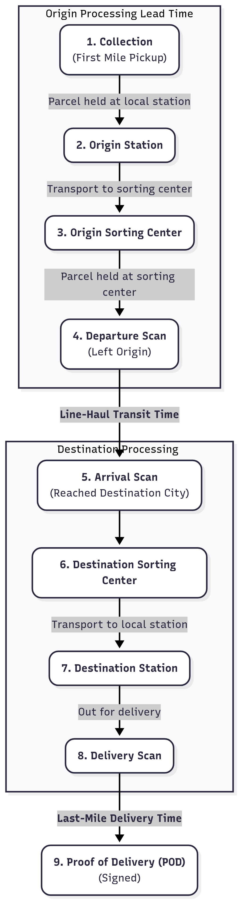

# Logistics Industry Analysis Data Pipeline

An automated ETL pipeline designed to ingest, process, and model raw operational data from China's major logistics companies, delivering analysis-ready data for downstream business intelligence and reporting tasks.

---

## 🌟 Project Overview & Motivation

During my internship at the **Development and Research Center of the State Post Bureau**, I was responsible for analyzing the monthly and quarterly performance reports from over 10 leading logistics firms. This process was initially manual, time-consuming, and prone to human error.

To solve this, I independently designed and developed this data pipeline. Its core mission is to **automate the entire workflow**, from raw, unstructured report ingestion to the generation of clean, structured, and analysis-ready datasets. This project successfully transformed a multi-day manual task into an efficient, reliable, and scalable automated process.

## ✨ Key Features & Capabilities

- **Automated Data Ingestion**: Processes raw report files (`.xlsx`) from various companies with different formats and structures.
- **Robust Data Cleaning & Standardization**: Programmatically handles inconsistencies, missing values, and varying column names (e.g., mapping "包裹量" and "件量" to a unified `parcel_volume`).
- **Configuration-Driven Parsing**: Utilizes Python dictionaries to define company-specific parsing rules, making the pipeline easily maintainable and extensible to new data sources without changing the core code.
- **Modular ETL/ELT Process**: The pipeline is structured into clear, sequential stages mimicking professional ETL/ELT workflows:
    1.  **Data Preprocessing**: Initial cleaning and preparation.
    2.  **Intermediate Data Hub**: Aggregates and integrates data from multiple sources into a central, standardized format.
    3.  **Analysis & Output Generation**: Performs specific monthly and quarterly analysis, and generates final datasets.
- **Single Source of Truth**: The pipeline's output serves as a reliable, single source of truth for all downstream analytical tasks, ensuring data consistency for clients and internal teams.

## 🛠️ Tech Stack

- **Core Language**: Python 3.13
- **Data Manipulation**: Pandas, NumPy
- **Development Environment**: VS Code, Jupyter Notebook
- **Version Control**: Git & GitHub
- **Dependency Management**: `uv` (as seen in `uv.lock`)

## 🌊 Pipeline Flow Diagram

Here is a high-level overview of the data flow:

*Business Flow:*


*Data Flow:*


## 🚀 How to Run

1.  **Clone the Repository**
    ```bash
    git clone git@github.com:ZhaohaibeiLava/Logistics-Industry-Analysis-Data-Pipeline.git
    cd Logistics-Industry-Analysis-Data-Pipeline
    ```

2.  **Set up the Python Environment**
    ```bash
    # (Recommended) Create and activate a virtual environment
    python3 -m venv .venv
    source .venv/bin/activate

    # Install dependencies using uv
    pip install uv
    uv pip sync
    ```

3.  **Prepare Input Data**
    Place the raw Excel report files into the designated input directories as structured in the notebooks.

4.  **Execute the Notebooks Sequentially**
    Open the project in VS Code or Jupyter and run the notebooks in the following order:
    1. `1_data_preprocess.ipynb`
    2. `2_intermediate_DataHub.ipynb`
    3. `3_ZTO_EMS_analysis_monthly.ipynb`
    4. `4_EMS_analysis_quarterly.ipynb`

## 📜 Disclaimer

**All data processed by this pipeline in the public repository is synthetic, anonymized, or derived from public sources for demonstration purposes. It does not contain any sensitive or confidential information from my internship.**